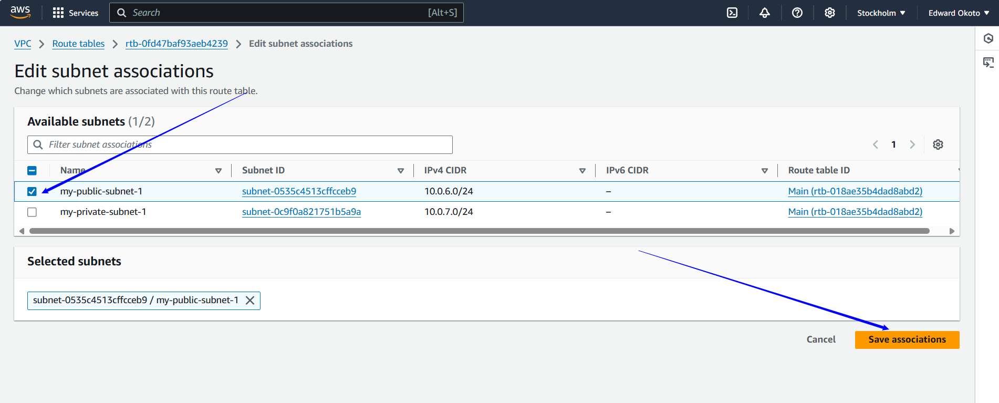
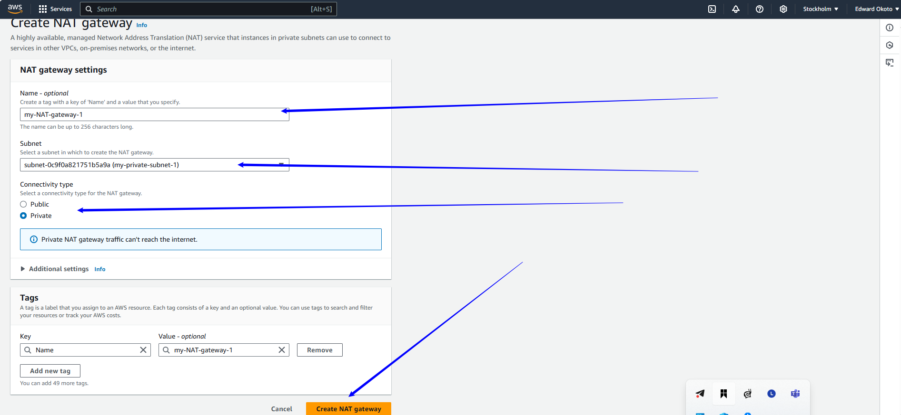
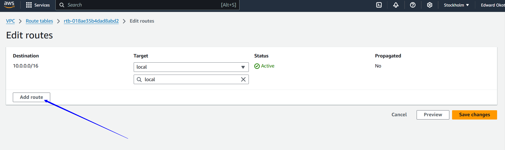
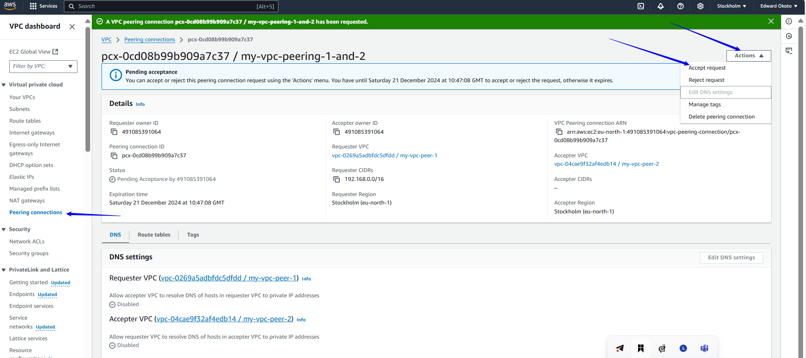

# AWS Virtual Private Cloud ( VPC )
### Project Goals
* Understand the fundamentals of VPC and its components.
* Gain hands on experience in setting up and condifuring VPC,subnets,subnets,internet gateways,NAT gateway and VPC peering connection.
* Learn how to enable internet connectivity securely within a VPC
* Implement outbound internet access through the NAT gateway.
* Establish direct communication and between VPCs using VPC peering.

## What is VPC, Subnets, Internet gateway and NAT gateway ?
##### VPC (Virtual Private Cloud)

A Virtual Private Cloud (VPC) is a logically isolated section of the AWS cloud where you can launch AWS resources in a virtual network that you define. It provides control over your virtual networking environment, including selection of your IP address range, creation of subnets, and configuration of route tables and network gateways.

##### Subnets
Subnets are subdivisions of a VPC's IP address range. They allow you to segment your network within the VPC. Subnets can be:

Public Subnets: Accessible from the internet, used for resources that need to be reachable publicly, like web servers.

Private Subnets: Not directly accessible from the internet, used for resources that should not be publicly accessible, like databases.

##### Internet Gateway
An Internet Gateway is a horizontally scaled, redundant, and highly available VPC component that allows communication between instances in your VPC and the internet. It's attached to the VPC and enables resources in public subnets to access the internet and be accessed from the internet.

##### NAT Gateway
A Network Address Translation (NAT) Gateway is used to allow instances in a private subnet to connect to the internet or other AWS services, but prevent the internet from initiating a connection with those instances. This helps maintain security by keeping the instances private while still allowing them to access external resources.

##### How They Work Together
VPC: The overarching virtual network.

Subnets: Segments within the VPC, separating public and private resources.

Internet Gateway: Facilitates internet access for public subnets.

NAT Gateway: Allows private subnet instances to access the internet securely.

##### Visual Overview
Imagine the VPC as your entire private network in the cloud. Within this network, you have subnets dividing the space:

Public subnets with direct internet access through an Internet Gateway.

Private subnets accessing external resources via a NAT Gateway without being exposed to the public internet.

### What is IP address
An IP address (Internet Protocol address) is a unique identifier assigned to each device connected to a network that uses the Internet Protocol for communication. It's like an address that allows devices to find and communicate with each other over the internet or a local network.

##### Types of IP Addresses
IPv4: This is the most commonly used version of IP addresses, consisting of four sets of numbers separated by periods (e.g., 192.168.0.1). It allows for about 4.3 billion unique addresses.

IPv6: Due to the growing number of devices, IPv6 was introduced. It consists of eight groups of four hexadecimal digits separated by colons (e.g., 2001:0db8:85a3:0000:0000:8a2e:0370:7334). It supports a much larger number of unique addresses.

##### Types of IP Address Categories
Public IP Address: Assigned to devices that connect to the internet. These addresses are unique across the entire internet.

Private IP Address: Used within a private network (like a home or office network). These are not routable on the internet and allow devices within the network to communicate with each other.

Dynamic vs. Static IP Addresses
Dynamic IP Address: Assigned automatically by a DHCP (Dynamic Host Configuration Protocol) server and may change over time.

Static IP Address: Manually assigned and remains constant, often used for servers or network devices that need a permanent address.

##### Why IP Addresses Matter
IP addresses are essential for internet communication. They:

Enable devices to locate and communicate with each other.

Allow routers and switches to route data packets to the correct destination.

Provide a way to identify devices on a network, facilitating network management and security.

### What is CIDR
CIDR (Classless Inter-Domain Routing) is a method for allocating IP addresses and routing Internet Protocol packets. It was introduced to replace the older system of IP address classes (A, B, C) and to improve the allocation of IP addresses, which helps in reducing the waste of IP address space.

##### Key Concepts of CIDR:
 1.IP Address and Prefix:

* A CIDR notation includes an IP address and a suffix indicating the number of bits in the subnet mask.

  Example: 192.168.1.0/24

  *  192.168.1.0 is the IP address.

  * /24 indicates that the first 24 bits are the network part of the address.

2.Subnet Mask:

* The suffix in CIDR notation defines the subnet mask.

* In 192.168.1.0/24, the subnet mask is 255.255.255.0.

3.Flexible Subnetting:

* CIDR allows for more efficient use of IP address space by permitting the creation of subnets of varying sizes.

* Instead of fixed sizes in classful addressing (like /8, /16, /24), CIDR can support subnets like /28, /29, etc.

##### Benefits of CIDR:
1.Efficient IP Address Allocation: Reduces the number of wasted IP addresses by allowing flexible subnet sizes.

2.Simplified Routing: Aggregates routes into a single route, reducing the size of routing tables and making the internet more efficient.

3.Scalability: Supports the growth of networks and the internet by allowing more efficient IP address allocation.

##### Example:
* CIDR Notation: 192.168.1.0/24

* IP Range: 192.168.1.0 to 192.168.1.255

* Subnet Mask: 255.255.255.0

### What is gateway
A gateway in networking is a device or software that serves as a bridge between different networks, enabling data to flow from one network to another. It acts as an entry and exit point for a network, controlling traffic and facilitating communication between different network architectures or protocols.

##### Types of Gateways:
1.Network Gateway:

* Connects two networks using different protocols.

* Ensures data is properly formatted and translated for the receiving network.

2.Internet Gateway (in AWS):

* Allows communication between instances in a VPC and the internet.

* Provides a target in your VPC route tables for internet-routable traffic.

3.NAT Gateway (Network Address Translation):

* Enables instances in a private subnet to connect to the internet or other AWS services.

* Prevents the internet from initiating a connection with those instances.

4.Application Gateway:

* Manages traffic at the application layer.

* Often used for load balancing and managing web application traffic.

##### Functions of a Gateway:
* Protocol Translation: Converts data between different protocols to ensure compatibility and communication.

* Traffic Management: Directs data packets to the appropriate network or device.

* Security: Acts as a firewall to filter traffic and protect the network.

* Connectivity: Bridges different network environments, such as local networks and cloud environments.

##### Example in AWS:
In an AWS environment, an Internet Gateway is used to provide internet access to instances within a VPC, while a NAT Gateway allows instances in private subnets to access the internet without being directly accessible from the internet.

### What is route table
A route table is a key component in networking that defines the rules for routing traffic within a network. It contains a set of rules, called routes, that determine where network traffic should be directed based on the destination IP address. In AWS, route tables are used to control the routing of traffic within Virtual Private Clouds (VPCs) and between VPCs and external networks.

##### Key Elements of a Route Table:
* Routes: Each route consists of a destination IP address (or range) and a target (such as an internet gateway, NAT gateway, VPC peering connection, or network interface).

* Local Route: A default route that enables communication within the VPC.

* Explicit Routes: Additional routes that direct traffic to specific destinations, such as other subnets, internet gateways, or VPN connections.

##### Types of Route Tables in AWS:
* Main Route Table: The default route table that automatically comes with your VPC. All subnets are initially associated with the main route table unless explicitly associated with another route table.

* Custom Route Tables: Additional route tables that you can create and associate with specific subnets to manage traffic differently.

##### Example of a Route Table Entry:
* Destination: 0.0.0.0/0 (Represents all IP addresses)

* Target: igw-12345678 (An internet gateway)

This entry means that traffic destined for any IP address is routed through the specified internet gateway.

##### Functions of a Route Table:
* Routing Traffic: Directs traffic based on destination IP addresses.

* Network Segmentation: Manages and controls traffic flow between different subnets within a VPC.

* Internet Access: Configures routes to direct traffic to and from the internet via internet gateways or NAT gateways.

* VPN and Direct Connect: Routes traffic between VPCs and on-premises networks using VPN connections or AWS Direct Connect.

### Connection between gateway and route table
In AWS, the relationship between a gateway (such as an Internet Gateway or NAT Gateway) and a route table is crucial for managing the flow of network traffic within a Virtual Private Cloud (VPC). Here's how they work together:

##### Internet Gateway and Route Table
Internet Gateway (IGW):

* An Internet Gateway allows instances in a VPC to communicate with the internet.

* It is attached to the VPC and provides a target for internet-routable traffic.

##### Route Table:

* Contains routing rules (routes) that determine where network traffic should be directed based on its destination.

* When you want instances in a subnet to access the internet, you need to add a route to the route table with the destination 0.0.0.0/0 (which represents all IP addresses) and the target as the Internet Gateway.

##### Example
Imagine you have a VPC with a public subnet that needs internet access:

* Attach an Internet Gateway to the VPC.

* Create a Route Table for the public subnet.

* Add a Route to the route table:

   * Destination: 0.0.0.0/0

  * Target: igw-12345678 (The ID of the Internet Gateway)

This setup allows traffic from the instances in the public subnet to route through the Internet Gateway to the internet.

# PRACTICALS

## Create VPC

* Login to your AWS account, navigate to the search bar, type VPC and click on VPC

  

* Navigate to "Create VPC" option and click on it.

  

* Specify "VPC only" option, chose IPV4 CIDR block, and click on "Create VPC"

  

   This is the VPC created.

  

## Configuring Subnets within the VPC

* Navigate to the "Subnet" section click it and then click "Create subnet" 

  

* Attach the intended Subnet to be created to the VPC just created.

  

* Enter the subnet name and chose an IPV4 CIDR for the subnet.
* Chose availability zone
* specify the subnet IPV4 CIDR
* To create another subnet,you can click on the "Add subnet"

  

* Repeat the process to create a private subnet and add it to the VPC as well. Click "Create subnet" when ready.

   

   The created Subnets

   

## Creating an Internet Gateway (IGW) and Attaching it to a VPC
* Navigate to the "Internet gateway" section click it and then click "Create Internet gateway" 

  

* Specify the name of the gateway and click "Create Internet gateway"

  

* Your internet gateway is successfully created but presently detached.

    

* Attach the internet gateway to your VPC to enable internet connectivity.

   

* Add the created VPC and click "Attach internet gateway"
   
    

* Internet gateway has been attached.

    

## Enabling Internet Connectivity with the internet Gateway by setting up routing tables.

 * Navigate to the "Route tables" section and click on "Create route table"
   
   

* Name the route table, add your VPC created  and click "Create route table"

   

   

* Next, click on subnet associations and click edit subnet associations to associate the subnets with this route table.We will associate the public network with this route table.

   

* Select the public subnet and click "Save associations"
 

* Navigate to "Routes" and click "Edit routes"
 

* Click "Add route"

  

* Select destination 0.0.0.0/0 indicating all IPV4 address can access the subnet
  In the "Target field", chose "Internet Gateway" and then select the internet gateway you created ,Finally save the changes.

   

  The route table has now been configured to route traffic to the internet gateway allowing connectivity to the internet.Since only the subnet names "my-public-subnet-1" is associated with this route table,only resources within that subnet can access the internet.

   

## Enabling Outbound Internet access with the internet through NAT Gateway by Attaching the NAT-Gateway to the subnet and attach.

* Navigate to the "NAT gateway" section and click on "Create NAT gateway"
    
  

* Name the NAT gateway
* Choose the private subnet.
* Select the connectivity type as "Private".
* Click on "Create Nat gateway"

   

* Nat gateway has been created successfully.

   

* Select the NAT gateway you created.
* Then navigate to the "Details" tab.
* From there locate the subnet ID and click on it.

   

* In the subnet page, navigate to the "Route table"
* Then click on the route table ID, in our case it is rtb-018ae35b4dad8abd2

   

* Proceed to "Route" section and click on "Edit routes"

   

* Click on "Add route"

   

* Select Destination as 0.0.0.0/0
* In the "Target field", choose NAT gateway
* Select the NAT gateway created and click "Save changes"
    

* NOW, on the "Subnet association". click "Edit subnet"

    

* Choose the private subnet and click "Save associations"

    
    
    
    

### What is VPC peering

VPC peering is a networking feature in Amazon Web Services (AWS) that enables secure and direct communication between two Virtual Private Clouds (VPCs). This private connection allows resources in the peered VPCs to interact with each other as if they were part of the same network, eliminating the need to traverse the public internet1.

#### Key Features of VPC Peering:
* Private Communication: Traffic between peered VPCs remains within the AWS network and does not traverse the public internet.

* Cross-Account and Cross-Region: You can peer VPCs within the same AWS account, across different accounts, or even across different AWS regions.

* No Additional Hardware: VPC peering leverages the existing VPC infrastructure without requiring gateways, VPNs, or physical hardware.

* Flexible Resource Sharing: Enables sharing of resources like databases, web servers, and other services across VPC boundaries.

#### How to Establish VPC Peering:
* Request Peering Connection: The owner of the requester VPC sends a peering connection request to the owner of the accepter VPC.

* Accept Peering Connection: The owner of the accepter VPC accepts the request to activate the peering connection.

* Update Route Tables: Both VPC owners must manually add routes to their VPC route tables to enable traffic flow between the peered VPCs.

* Update Security Groups: Ensure that security group rules allow traffic between the peered VPCs.

#### Use Cases:
* Multi-Tier Applications: Connect web servers in one VPC to database servers in another VPC.

* Resource Sharing: Share resources between different teams or business units within an organization.

* Hybrid Cloud: Connect on-premises networks to AWS VPCs for seamless integration

### Why do we need VPC Peering
VPC peering is essential for several reasons, especially in the context of scalable and secure cloud architecture. Here are some key benefits and use cases:

* Private Communication: VPC peering allows secure, direct communication between VPCs without traversing the public internet. This improves security and performance by keeping traffic within the AWS network.

* Resource Sharing: It enables the sharing of resources (like databases, file storage, and services) across different VPCs. For example, different departments within an organization can share common infrastructure without exposing it to the public internet.

* Cost Efficiency: By keeping traffic within AWS, VPC peering can reduce data transfer costs compared to using internet-based communication methods.

* Simplified Management: It simplifies network management by using familiar AWS tools and services to set up and maintain connections between VPCs.

* Scalability: VPC peering supports the growth of your architecture, allowing you to seamlessly integrate new VPCs as your network expands. This is particularly useful for multi-tier applications or microservices architectures.

* Hybrid Cloud Integration: VPC peering can be used to connect AWS environments with on-premises networks or other cloud providers, supporting a hybrid cloud strategy.

* Compliance and Security: It ensures that data transfer remains compliant with regulatory requirements by keeping sensitive data within a controlled environment.

By leveraging VPC peering, you can build a more secure, efficient, and scalable cloud infrastructure.

PRACTICALS: VPC Peering

* Let start by creating two VPCs in same or different regions.

   VPC1

   

   VPC2

   

* Navigate to the "Peering Connection" section abd click "Create peering connection"
  
   

* Name the VPC peering,
* Select the requester VPC
* Choose the account,my account since the VPC is in our own AWS account.
* Select this region as the VPC was created in that region
* Select the acceptor VPC
* Proceed by clicking on the "Create Peering connection" button.

   
   

  Then, you will see this page.

  

* In the Peering connection page,locate "Action",click the drop down and select "Accept request"

  
  

* Click on "Accept request"

  
  

* Click on the Main route table ID of the acceptor VPC

  

* Choose the route table and navigate to the "Routes" section.
* Click on "Edit route"
 
   

* Click on "Add route", Select the requester CIDR and on the target field, select "peering connection" and save changes.

   
   

* Click on the Main route table ID of the Requester VPC

  

* Choose the route table and navigate to the "Routes" section.
* Click on "Edit route"
 
   

* Click on "Add route", Select the requester CIDR and on the target field, select "peering connection" and save changes.

   
   

The peering connection has been successfuly established.

